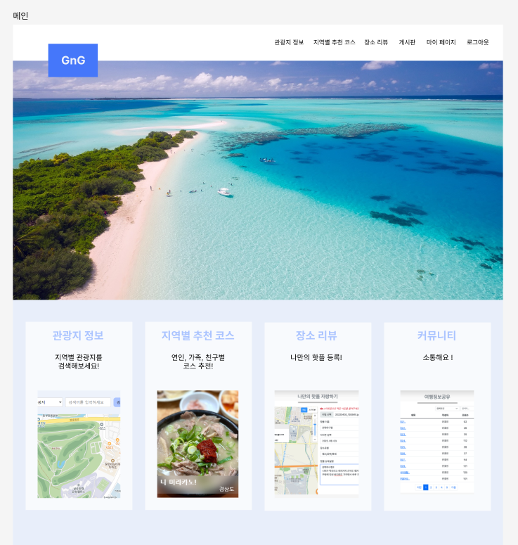
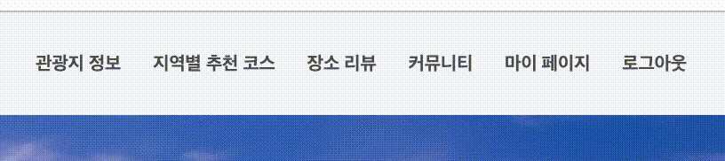
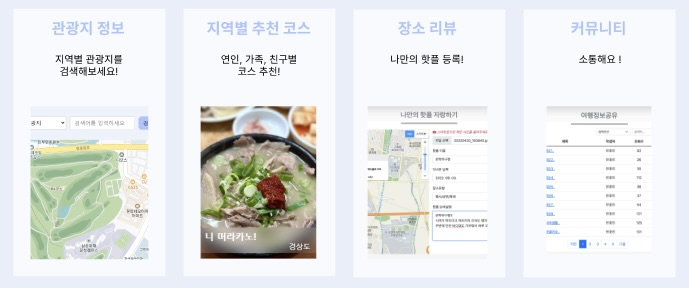
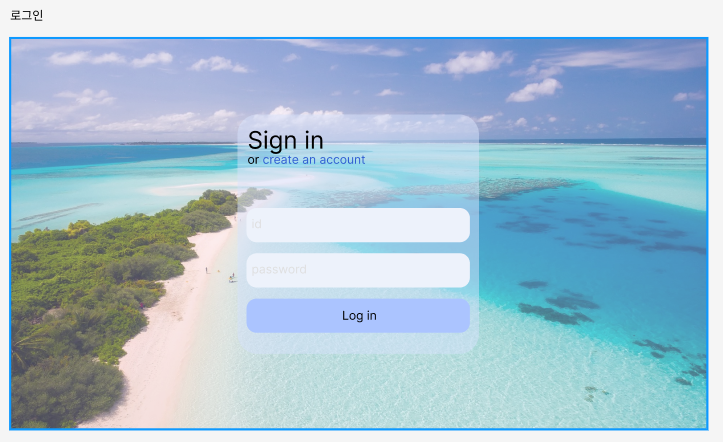
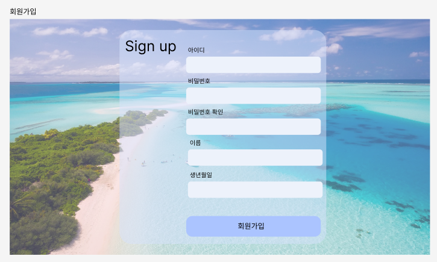
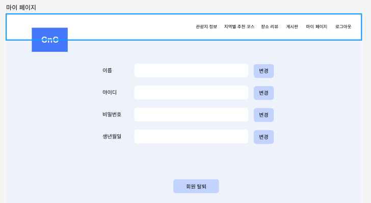
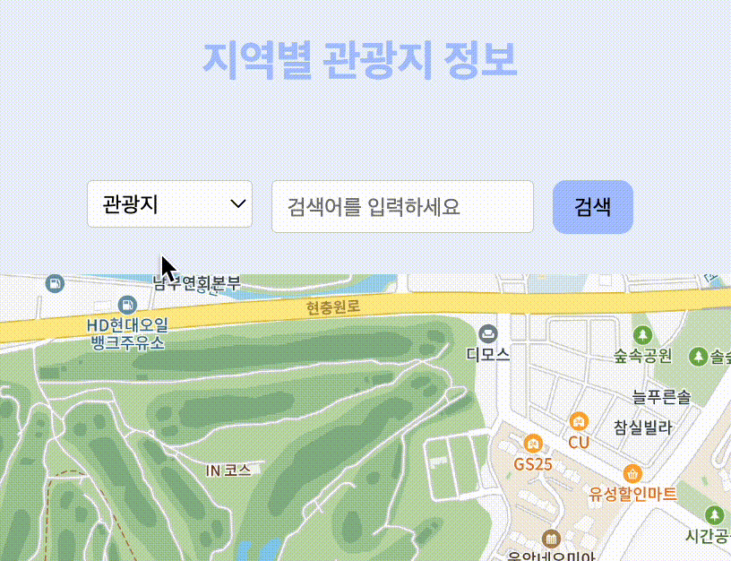
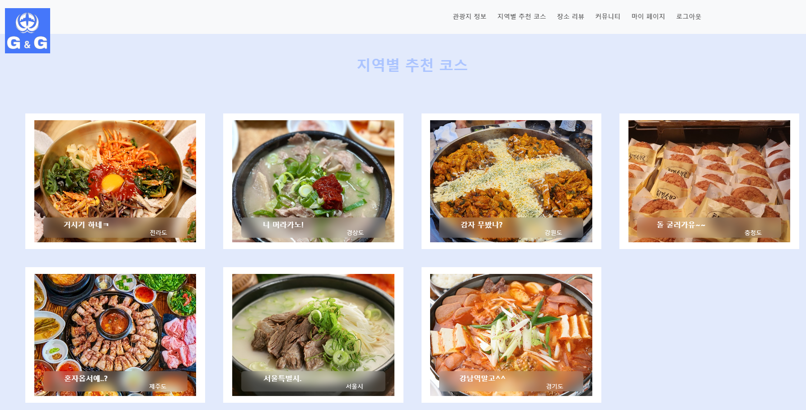
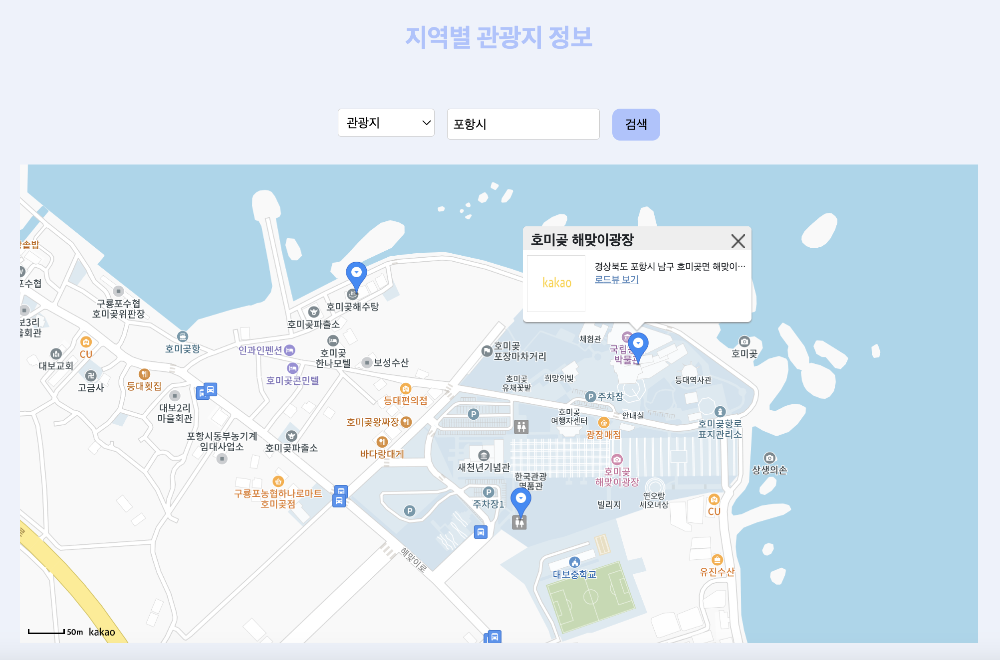

- [BackEnd 관통 프로젝트](#backend-관통-프로젝트)
  - [프로젝트 개요](#프로젝트-개요)
    - [컨벤션](#컨벤션)
      - [Branch](#branch)
      - [Commit Message](#commit-message)
  - [FrontEnd 화면 구성](#frontend-화면-구성)
    - [0️⃣ 메인화면](#0️⃣-메인화면)
    - [1️⃣ 로그인 화면](#1️⃣-로그인-화면)
    - [2️⃣ 회원가입 화면](#2️⃣-회원가입-화면)
    - [3️⃣ 마이 페이지 화면](#3️⃣-마이-페이지-화면)
    - [4️⃣ 관광지 정보](#4️⃣-관광지-정보)
    - [5️⃣ 지역별 추천 코스](#5️⃣-지역별-추천-코스)
  - [BackEnd 기능 추가](#backend-기능-추가)
    - [1️⃣ 지역별 관광지 정보 수집](#1️⃣-지역별-관광지-정보-수집)
    - [2️⃣ 관광지, 숙박, 음식점 조회](#2️⃣-관광지-숙박-음식점-조회)
    - [3️⃣ 문화시설, 공연, 여행코스, 쇼핑 조회](#3️⃣-문화시설-공연-여행코스-쇼핑-조회)
    - [4️⃣ 지역별 여행 코스 추천](#4️⃣-지역별-여행-코스-추천)
    - [5️⃣ 회원 관리](#5️⃣-회원-관리)
    - [6️⃣ 로그인 관리](#6️⃣-로그인-관리)
    - [7️⃣ 커뮤니티](#7️⃣-커뮤니티)

---

# BackEnd 관통 프로젝트

## 프로젝트 개요

- 사용자에게 한국의 다양한 관광지, 먹거리, 축제, 행사 등을 소개하여 지역 관광 활성화를 위한 지역 관광 소개 페이지를 구축하려고 한다. 한국관광공사에서 제공하는 국문관광정보서비스\_GW의 다양한 상세기능정보 API를 활용하여 지역별 관광지 data를 분석하고 화면에 표시한다. 또한 여행계획을 위한 스케줄과 여행경로 공유 등 사용자 편의 기능을 구현해 본다. 추가적으로 나만의 숨은 관광지를 소개하는 페이지와 자유롭게 토론이 가능한 게시판 등을 구현해 본다.

### 컨벤션

#### Branch

`Ex. Type/#Issue.number-Title`

`master` : 최종본

`env` : 환경 설정

`feat` : 이슈 별 기능 개발

`refactor` : 리팩토링

`fix` : 오류 수정

`test` : 테스트 코드 작성

#### Commit Message

`Ex. [ Type ] Title`

`env` : 환경 설정

`feat` : 기능 개발

`refactor` : 리팩토링

`fix` : 오류 수정

`chore` : Gradle 설정, 기타 작업

`test` : 테스트 코드 작성

**커밋 단위는 세부 기능 기준!!**

 

---

## FrontEnd 화면 구성

### 0️⃣ 메인화면

📑 : 헤더, 메인 컨텐츠로 구성 

- #### 헤더

  - 로고 : 클릭 시 메인 페이지로 이동  
    
      

  - 상단바 메뉴 : 로그인과 회원가입 메뉴 클릭 시 해당 페이지로 각각 이동  
    

- #### 메인 컨텐츠

  - 여행지 컨텐츠 : 클릭 시 상세 정보 페이지로 이동  
    
      

---

### 1️⃣ 로그인 화면

  
  
---
### 2️⃣ 회원가입 화면
  
  

---

### 3️⃣ 마이 페이지 화면

  
  
  📑 : 검색창, 지도, 카드로 구성 

---

### 4️⃣ 관광지 정보

- 지역별 관광지 정보 키워드 검색창

  
     

- 키워드와 선택한 정보에 따른 지도 화면

  
     

- 카테고리 변경 후 지도 화면 변경

  
     

- 커스텀 오버레이 내의 로드뷰로 이동

  
     

- 마커 및 커스텀 오버레이 열고 닫기

  

---

### 5️⃣ 지역별 추천 코스

  

---

## BackEnd 기능 추가

  

### 1️⃣ 지역별 관광지 정보 수집

- 카카오맵 API를 통해 검색어를 입력받아서 해당 좌표를 가져온 후,
  가져온 좌표를 통해 설정한 범위와 개수로 지역별 관광지 정보를 조회한다.
  

---

### 2️⃣ 관광지, 숙박, 음식점 조회

  
   
  
---

### 3️⃣ 문화시설, 공연, 여행코스, 쇼핑 조회

### 4️⃣ 지역별 여행 코스 추천

### 5️⃣ 회원 관리

- 마이페이지 : 회원정보 조회, 수정, 탈퇴 기능(servlet,jsp,DB)
  
   

---

### 6️⃣ 로그인 관리

- 로그인 :회원정보 조회(servlet,jsp,DB). 로그인 결과 전송(ajax)
  
    

- 회원가입 :회원정보 추가(servlet+jsp, DB). 아이디 중복검사(ajax). 비밀번호 확인(javaScript)
  

---

### 7️⃣ 커뮤니티

- 글 등록,조회,수정,삭제 기능(CRUD) (servlet,jsp,DB)

    
    
    

- 글 목록 paging 기능

    

- 키워드 검색 기능 (글번호,제목,작성자)

    

 

---
