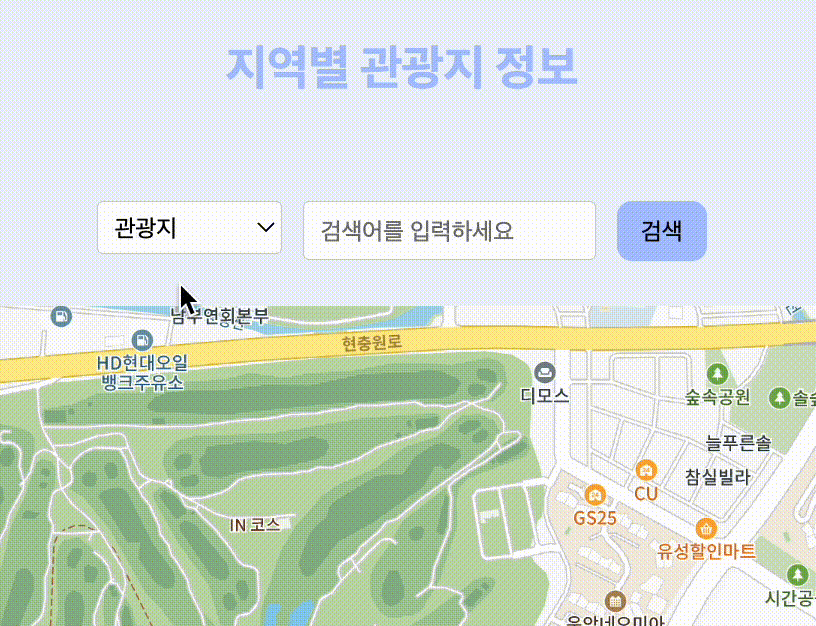

# FrontEnd 관통 프로젝트

## 프로젝트 개요

- 사용자에게 한국의 다양한 관광지, 먹거리, 축제, 행사 등을 소개하여 지역 관광 활성화를 위한 지역 관광 소개 페이지를 구축하려고 한다. 한국관광공사에서 제공하는 국문관광정보서비스\_GW의 다양한 상세기능정보 API를 활용하여 지역별 관광지 data를 분석하고 화면에 표시한다. 또한 여행계획을 위한 스케줄과 여행경로 공유 등 사용자 편의 기능을 구현해 본다. 추가적으로 나만의 숨은 관광지를 소개하는 페이지와 자유롭게 토론이 가능한 게시판 등을 구현해 본다.

### 화면 구성

화면 구성
- [메인화면](#0️⃣-메인화면)

- [로그인](#1️⃣-로그인-화면)

- [회원가입](#2️⃣-회원가입-화면)

- [마이 페이지](#3️⃣-마이-페이지-화면)

- [관광지 정보](#4️⃣-관광지-정보)

- [지역별 추천 코스](#5️⃣-지역별-추천-코스)

- [장소 리뷰](#6️⃣-장소-리뷰)

- [커뮤니티](#7️⃣-커뮤니티)

---

### 0️⃣ 메인화면

📑 : 헤더, 메인 컨텐츠로 구성 

- #### 헤더

  - 로고 : 클릭 시 메인 페이지로 이동  
    
      

  - 상단바 메뉴 : 로그인과 회원가입 메뉴 클릭 시 해당 페이지로 각각 이동  
    

- #### 메인 컨텐츠

  - 여행지 컨텐츠 : 클릭 시 상세 정보 페이지로 이동  
    
      

---

### 1️⃣ 로그인 화면

  
  
---
### 2️⃣ 회원가입 화면
  
  

---

### 3️⃣ 마이 페이지 화면

  
  
  📑 : 검색창, 지도, 카드로 구성 

---

### 4️⃣ 관광지 정보

- 지역별 관광지 정보 키워드 검색창

  
     

- 키워드와 선택한 정보에 따른 지도 화면

  
     

- 카테고리 변경 후 지도 화면 변경

  
     

- 커스텀 오버레이 내의 로드뷰로 이동

  
     

- 마커 및 커스텀 오버레이 열고 닫기

  

---

### 5️⃣ 지역별 추천 코스

  

---

### 6️⃣ 장소 리뷰

구현 예정

---

### 7️⃣ 커뮤니티

구현 예정

---
